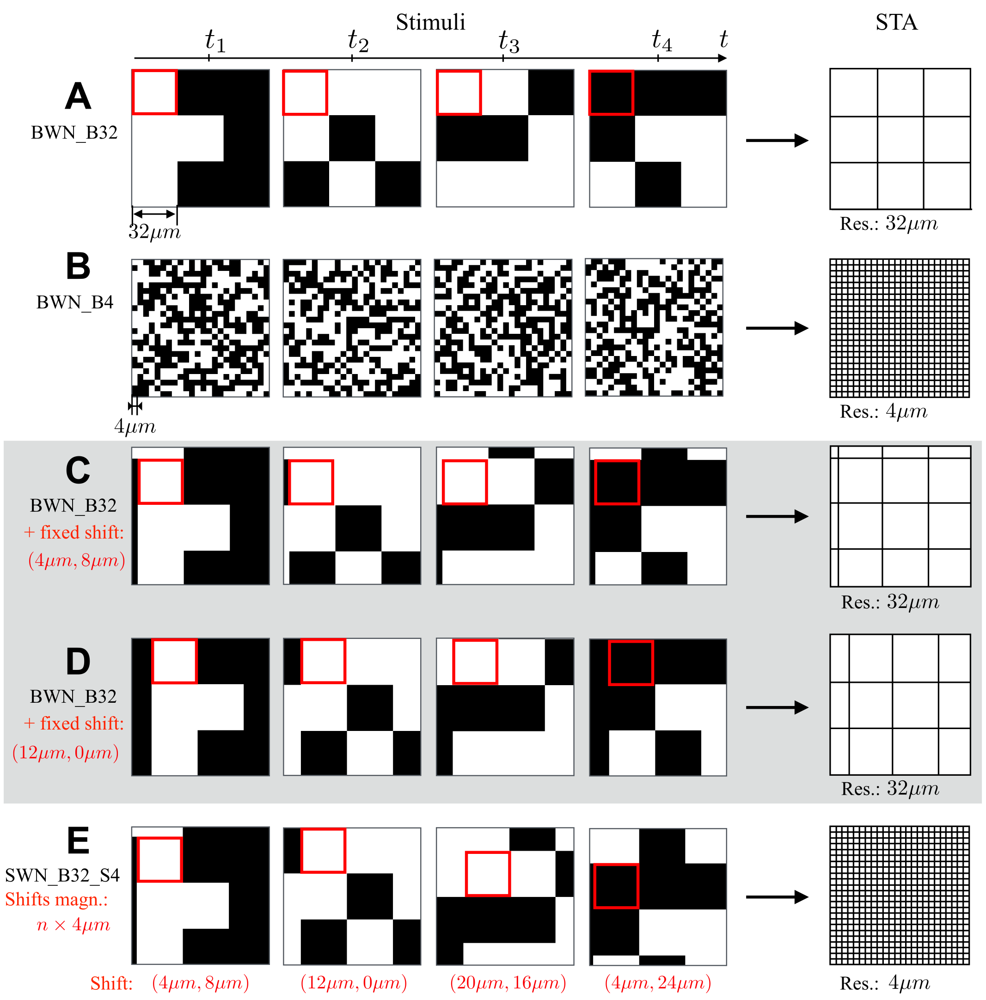

#  Receptive field estimation in large visual neuron assemblies using a super-resolution approach

The shifted white noise (SWN) is a novel stimuli that by introducing random spatial shifts in the usual white noise stimulus increases the resolution of the measurements, estimating faster and more acurater visual receptive fields.

### How to install dependencies

This code depends on basic python packages, to install automatically the dependencies type on your terminal:

pip install -r requirements.txt

### How to run

If you want to generate 12 images, of 200 pixels, with blocks of 20 pixels, baseline shift 4 pixels and save in the folder /home/Test_SWN/, you open a terminal on the folder where the code is and type:

python generate_SWN.py -T 12 -N 200 -beta 20 -alpha 4 -o /home/Test_SWN/

This is a self-standing code and you just have to change the parameters in the terminal.

The parameters follow the same notation as in the article. For more details, see XXX.

### How to get help
If you want to understand the meaning of the paramenetrs and some help on running the code you type: 

python generate_SWN.py --help 

The output should be something like this:

usage: generate_SWN.py [-h] -T T -N N -beta BETA -alpha ALPHA -o OUTPUT_FOLDER_PATH

Parser to generate SWN

optional arguments:
  -h, --help            show this help message and exit
  -T T                  Number of images
  -N N                  Image size in pixels
  -beta BETA            Block size in pixels
  -alpha ALPHA          Baseline shift size in pixels
  -o OUTPUT_FOLDER_PATH
                        Output folder path. It is recommended to use the absolute path.

 

### Documentation
The journal article describing and evaluating the SWN is available here:XXX
If you use this code, please do not forget to cite the article. 
The bibtex entry is below.
XXX

