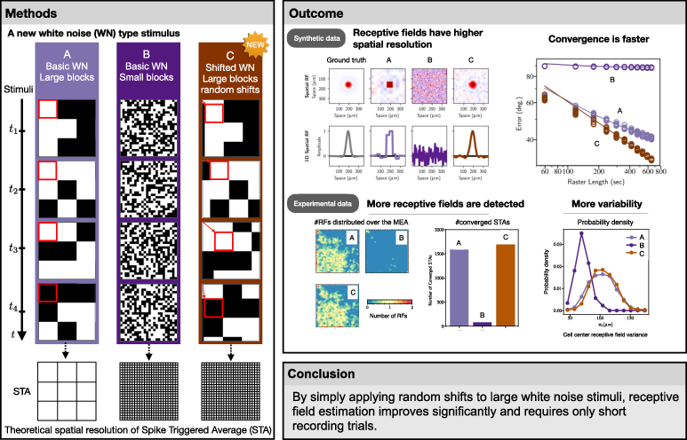

#  Receptive field estimation in large visual neuron assemblies using a super-resolution approach

The shifted white noise (SWN) is a stimuli that, by introducing random spatial shifts in the usual white noise stimulus, increases the resolution of the measurements, estimating faster and more acurater visual receptive fields.

### Instalation
1) Clone the code or download and unzip it. Go to the directory where the code is. 

2) Update your conda envioronment. If you don't have conda installed in your computer, go to the *[conda webpage](https://docs.conda.io/projects/conda/en/latest/index.html)* and install it. Conda allows to create envioronments to manage packages and avoid incompatabilities between dependencies, for more details why you should use conda, you can follow this *[link](https://towardsdatascience.com/why-you-should-use-a-virtual-environment-for-every-python-project-c17dab3b0fd0)*.

$ conda update conda

3) Create the SWN envioronment and install the requirements 

$ conda env create -f SWN-env.yml

4) Activate the envioronment 

$ conda activate SWN

### Usage

If you want to generate 12 images, of 200 pixels, with blocks of 20 pixels, baseline shift 4 pixels and save in the folder ./Test-SWN, you open a terminal on the folder where the code is and type:

python generate-SWN.py -T 12 -N 200 -beta 20 -alpha 4 -o ./Test-SWN

This is a self-standing code and you just have to change the arguments in the terminal.

Images will be saved in the folder OUTPUT-FOLDER-PATH. If this folder does not exists, it will be created. Stimulus images images will be called image_YYY.png where YYY is the image number padded with zeros. The number of zeros is defined automatically in such way that the number of digits is the same for the entire dataset.
In addition to the images, the arguments will be saved automatically in a file called args.txt and the histograms of vertical and horizontal the shifts sizes for the entire dataset are saved in shifts-ditribution.png

### Help
If you want to understand the meaning of the paramenetrs and some help on running the code you type: 

python generate-SWN.py --help 

The output should be something like this:

usage: generate-SWN.py [-h] -T T -N N -beta BETA -alpha ALPHA -o OUTPUT-FOLDER-PATH

Parser to generate SWN

optional arguments:
  -h, --help            show this help message and exit
  -T T                  Number of images
  -N N                  Image size in pixels
  -beta BETA            Block size in pixels
  -alpha ALPHA          Baseline shift size in pixels
  -o OUTPUT-FOLDER-PATH
                        Output folder path.

The parameters follow the same notation as in the article. For more details, see XXX.

In addition you can directly write your question on discussion section, send an email to the *[Daniela Pamplona](daniela.pamplona@ensta-paris.fr)*.  

### Documentation
For more details on the SWN, please visit the *[project webpage](https://team.inria.fr/biovision/swn/)*.

### Citation
The journal article describing and evaluating the SWN is available here:XXX
If you use the SWN, please do not forget to cite the article. 
The bibtex entry is below.
XXX

